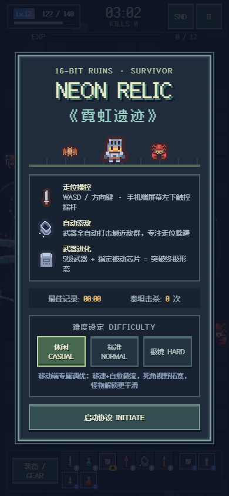
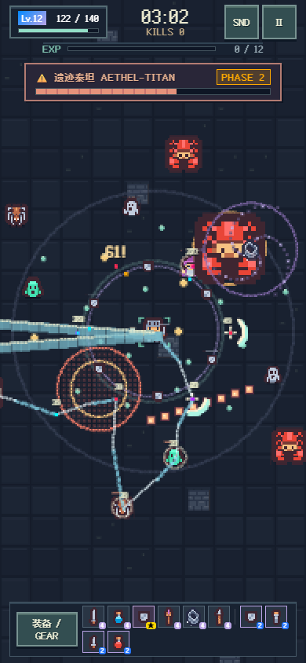
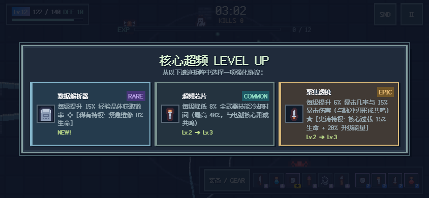

# 《霓虹遗迹 Neon Relic》

一款**手机优先**、使用原生 Canvas 2D + Web Audio API 的像素遗迹肉鸽生存游戏 (Arena Survivor + Roguelite + Build Crafting)。

## 像素版预览

以下为浏览器自动生成的固定展示场景，包含主菜单、Boss 战与横屏升级界面：

 



---

## 一、游戏特点

- **手机优先设计**：单手可操控的动态虚拟摇杆，自动锁定最近敌人，专注走位躲避弹幕；
- **防误触体验**：战场屏蔽默认触摸滚动，协议弹窗允许滑动浏览；适配刘海屏 Safe Area 与视网膜屏幕高清渲染；
- **深度肉鸽构筑**：
  - **6 大原创基础武器**（脉冲刃、电弧核心、轨道卫星、等离子炮、黑洞发生器、棱镜射线）；
  - **8 种被动芯片**（护甲递减、拾取范围、冷却缩减、暴击率/暴击伤、生命与自愈、移速、经验加成、技能范围）；
  - **6 大终极武器超级进化**（机制质变：光子幻刃 / 天罚风暴 / 坍缩超新星 / 极光环垒 / 湮灭重炮 / 超维裂隙）；
  - **机体协议抽屉 (PROTOCOLS)**：战斗中随时点击底部协议按钮，展开查看已装载武器输出伤害、进化词缀与激活被动；
- **丰富敌人与多阶段 Boss**：
  - 8 种常规敌人（追踪蜂群、闪避侦察、重装巨灵、远距狙击、裂变微核、突刺冲锋、修复祭司、扇射哨兵），特殊怪按时间解锁并限制数量；
  - 随机生成的精英怪物（带有**狂暴**、**护盾**、**分裂**三大词缀）；
  - 多阶段史诗 Boss「**遗迹泰坦 AETHEL-TITAN**」，具有清晰前摇、环形弹幕、地面危险区、暴怒阶段与进场清场震慑波；
- **像素美术与声音**：
  - 像素冒险者、八类怪物、遗迹地板、六武器攻击特效；战场采用半分辨率画布和最近邻放大；
  - 中文像素字体、硬边面板、像素装备图标，覆盖 HUD、升级选择、暂停和战报；
  - 移动端专属性能预算（粒子上限 120 / 浮动文字 25 / 高频音频节流）；实际帧率取决于设备，尚未完成低端手机真机验证；
  - 25 个本地 PCM WAV 音效，卫星使用轻护盾撞击，脉冲刃使用挥切，射线使用短持续能量声；电弧为短雷击，等离子炮为能量脉冲，死亡为碎裂。分组限频、重要提示优先与动态压缩见 [声音设计](docs/AUDIO_DESIGN.md)；
  - 循环 Chiptune BGM 音量为 4%；升级与进化选卡无提示音、音乐继续，暂停、查看装备或失焦时暂停音乐，`SND / OFF` 同时控制音乐与音效；
  - 脉冲刃带有从角色连接到目标的移动刀锋与像素拖尾，保留原有命中与伤害结算；
  - 音效兼容旧 iOS 的 PCM 解码，BGM 通过独立增益节点保持 4%；开始、继续和触屏可重新解锁被系统中断的音频；
  - 二进制素材合计约 3.52 MB（含保留的原始 OGG），无 CDN 依赖。美术与音频采用免费 CC0 / CC BY 3.0 素材，字体使用 SIL OFL 1.1；来源与许可见 [素材清单](assets/CREDITS.md)。

---

## 二、操作指南

### 📱 手机端
- **移动**：手指触摸屏幕任意区域即可动态生成虚拟摇杆，按住拖动即可全方位移动；平滑线性度死区调优，走位更灵敏。
- **攻击**：无需频繁点攻击键，机体搭载的各武器将全自动对射程内的敌群展开智能索敌打击。
- **强化**：升级时游戏自动暂停，点击三选一卡片选择协议。
- **协议抽屉**：轻触底部 `装备 / GEAR` 可随时暂停并展开当前武器总伤与被动详情。
- **暂停/静音**：点击右上角 `Ⅱ` 暂停游戏，点击 `SND / OFF` 开关音乐和音效。所有按钮触控区域均符合 $\ge 44 \times 44\text{ px}$ 规范。

### 💻 桌面端
- **移动**：支持键盘 `W` `A` `S` `D` 或 `↑` `↓` `←` `→` 方向键。
- **暂停**：支持键盘 `Esc` 或 `P` 键。

---

## 三、武器与超级进化图鉴

| 基础武器 (Lv1-5) | 核心特性 | 进化所需被动芯片 | 进化形态与机制质变 |
| :--- | :--- | :--- | :--- |
| **脉冲刃** | 高频单体/前方小范围近身斩击 | **聚焦透镜** (暴击) | **光子幻刃**：斩击撕裂虚空留下多重残影，高频暴击连斩 |
| **电弧核心** | 连锁闪电在 3~8 个目标间跳跃 | **超频芯片** (攻速/CD) | **天罚风暴**：升华为全屏周期性神罚落雷，伴随冲击波 |
| **黑洞发生器** | 投放重力奇点牵引并造成持续 DoT | **能量扩增器** (范围) | **坍缩超新星**：强引力吸附，结束时产生毁灭超新星大爆炸 |
| **轨道卫星** | 3~5 颗近身卫星，命中击退、限频抵消外来子弹 | **纳米装甲** (护甲) | **极光环垒**：6 颗卫星与击退力场，每 0.3 秒挡一枚子弹 |
| **等离子炮** | 贯穿射击重型离子弹，强击退 | **光子喷流** (移速) | **湮灭重炮**：3联装高能离子光柱，极致穿透与多重命中 |
| **棱镜射线** | 蓄能贯穿全屏的高爆发几何激光 | **数据解析器** (经验) | **超维裂隙**：中央主激光高能锁定，双翼死光扇形大范围扫掠 |

---

## 四、被动芯片与属性公式

1. **纳米装甲 (Nano Armor)**：提升护甲，减伤采用国际经典收益递减公式：
   $$\text{Damage Reduction} = \frac{\text{Armor}}{\text{Armor} + 40} \quad (\text{硬上限 } 75\%)$$
2. **磁能发生器 (Magnetic Gen)**：每级扩大 $25\%$ 拾取半径。
3. **超频芯片 (Overclock Chip)**：每级降低 $8\%$ 技能冷却时间（最高缩减 $40\%$，与电弧核心形成共鸣，并同比例缩减轨道卫星的受击与护盾间隔）。
4. **聚焦透镜 (Focus Lens)**：每级提供 $+6\%$ 暴击率与 $+15\%$ 暴击伤害。
5. **量子核心 (Quantum Core)**：每级提升 $20\%$ 生命上限并获得每秒自愈微流。
6. **光子喷流 (Photon Thruster)**：每级提升 $8\%$ 移动速度。
7. **数据解析器 (Data Extractor)**：每级提升 $15\%$ 经验获取率。
8. **能量扩增器 (Amplifier Matrix)**：每级增加 $16\%$ 范围倍率，作用于各武器的半径或宽度。卫星固定 54 轨道，扩大核心接触面与进化力场宽度；挡弹不影响 Boss 地面危险区。

---

## 五、如何在本地运行

自动验收需 Node.js 22+ 和 Edge/Chromium：运行 `node tests/verify.cjs`。完整成长统计、验证器故障注入及报告生成见 [测试说明](test_notes.md)；当前数据见 [修复验收](FIX_VERIFICATION.md) 和 [战斗基准](BALANCE_REVIEW.md)。

声音的逐项判断与参考资料见 [行为音效检查](docs/AUDIO_AUDIT.md)；可用 [独立试听页](audio-review.html) 比较单项和多武器混合。

请通过静态 HTTP 服务器运行，确保本地音效可以被浏览器加载：

### 方法 1：Python 快速启动（推荐）
在项目根目录（或 `neon_relic` 目录）打开终端运行：
```bash
# 进入游戏目录
cd neon_relic

# 启动本地服务器
python -m http.server 8080
```
在电脑或手机（同一局域网 WiFi）浏览器访问：
```
http://localhost:8080
```
或手机输入电脑局域网 IP：
```
http://192.168.x.x:8080
```

### 方法 2：编辑器静态服务器
也可通过 VS Code Live Server 等静态服务器打开 `index.html`。直接双击使用 `file://` 会受到浏览器对音频 fetch 的限制，不能作为完整游玩方式。

---

## 六、免费部署到 GitHub Pages 教程

你可以将本项目免费发布到 GitHub Pages，一键生成属于你自己的在线手机游戏链接：

1. **新建 GitHub 仓库**：
   - 登录 [GitHub](https://github.com/)，点击右上角 **New repository**；
   - 仓库名称填写例如：`neon-relic`；
   - 仓库属性设为 **Public**，不要勾选添加额外文件，点击 **Create repository**。

2. **提交并推送到 GitHub**：
   在本地终端进入 `neon_relic` 目录，执行以下命令：
   ```bash
   git init
   git add .
   git commit -m "feat: release Neon Relic v1.0"
   git branch -M main
   git remote add origin https://github.com/你的用户名/neon-relic.git
   git push -u origin main
   ```

3. **开启 GitHub Pages 托管**：
   - 打开 GitHub 仓库页面，点击顶部的 **Settings** 选项卡；
   - 在左侧侧边栏中找到并点击 **Pages**；
   - 在 **Build and deployment** 下的 **Branch** 区域：
     - 分支选择：`main`
     - 目录选择：`/ (root)`
     - 点击 **Save**；
   - 等待约 1~2 分钟，页面上方会显示绿色提示：
     > *Your site is live at `https://<你的用户名>.github.io/neon-relic/`*

4. **手机游玩与分享**：
   - 将该网址在手机浏览器中打开；
   - iPhone 用户可在 Safari 中点击「分享」按钮 $\rightarrow$ **「添加到主屏幕」**，即可像原生 App 一样全屏无边框游玩！
   - Android 用户可在 Chrome 中点击菜单 $\rightarrow$ **「安装应用 / 添加到主屏幕」** 畅快体验！
