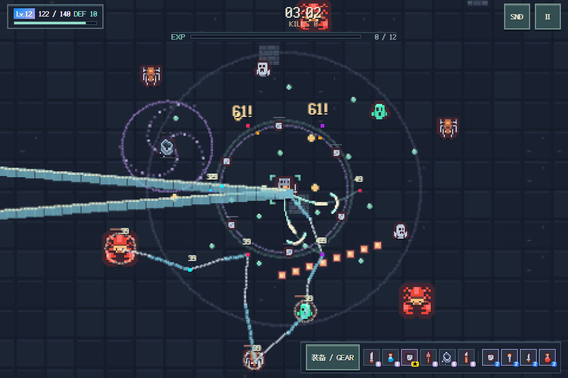
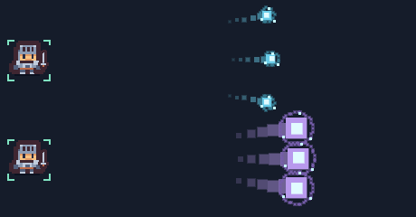

# 战斗声音与升级体验

## 采用的混音方式

多武器同时攻击允许同时发声，用分组、并发上限、优先级和动态音量控制可听性。

- 武器每种最多 2 声，所有武器合计最多 8 声；普通战斗组最多 12 声，重要提示组最多 4 声，全局另有 20 声硬上限。
- 结算 > Boss 警示 > 受伤 > Boss 死亡 > 大爆炸 > 进化攻击 > 基础攻击 > 小爆炸 > 普通死亡 > 命中 > 拾取。达到上限时优先淘汰更低优先级、同级更早的声音；重要声音不会被普通命中抢掉。
- 普通战斗声超过 3 声时逐步降低该组增益。重要提示出现时，普通战斗组再降到 35%，以约 15 ms 响应、150 ms 恢复，BGM 不随每次攻击反复抽动。
- 音效经过动态压缩器（阈值 -18 dB、比例 4:1）；采样使用短淡入淡出。压缩减少多声音叠加的峰值，不等同于硬限幅器，也不保证所有设备的主观响度相同。
- BGM 保持 4% 增益；音乐走独立 GainNode，与音效共享 AudioContext，不参与短促音效的声部抢占。

上述原则参考 [Wwise 的并发与优先级说明](https://www.audiokinetic.com/en/public-library/2024.1.8_8893/?id=optimizing_cpu&source=Help)、[Wwise 动态混音培训资料](https://media.gowwise.com/EducatorPortal/2024-10-01_Workshop_DynamicMixing.pdf) 和 [Web Audio 动态压缩说明](https://developer.mozilla.org/en-US/docs/Web/API/DynamicsCompressorNode)。具体数值是本项目的混音选择，不是行业统一标准。

## 升级界面

升级触发、进化选择和连续选卡不播放提示音；进入升级界面停止残留音效，并阻止新的战斗音效。BGM 连续播放，播放位置不重置。手动暂停、装备抽屉、结算、静音或系统失焦仍暂停音乐；失焦时完成选卡不会自动恢复。

## 闪电与脉冲刃

电弧使用 Jerimee 的 Thunder 雷击音效的 0.85 秒截取版，保留雷击起音与短衰减，避免长轰鸣覆盖其他武器。来源、CC BY 3.0 署名及修改说明见 [素材鸣谢](../assets/CREDITS.md)。

脉冲刃记录释放位置和目标位置，绘制连接两者的弯曲像素轨迹；亮刀锋沿轨迹移动并拖尾，约 0.26 秒淡出。角色移动不会把已释放的轨迹拖走。伤害仍按原有瞬时命中结算；轨迹是视觉反馈，不新增弹道碰撞或重复伤害。

## 等离子炮与死亡反馈

等离子炮使用白色亮核、青蓝色等离子外壳、旋转能量颗粒和渐细尾迹，进化后扩大能量球并变为紫蓝色；炮口有短闪光，命中有扩散环与碎片。碰撞半径、射速、穿透、伤害均保留原值。发射声为短促降频能量脉冲，替代旧的爆炸杂音。敌人死亡使用短碎裂消散声，避免普通击杀反复触发爆炸。

## 卫星、挥刃与射线的音色

卫星改为 0.12 秒轻护盾撞击，增益 0.11、实际接触或挡弹共享 230ms 限频，空转不发声。短尾音和较低响度适合持续贴身触发，避免旧高音电子啸叫反复抢占听觉。视觉增加短轨迹、接触圈和挡弹闪环。

脉冲刃改为 0.18 秒空气挥切与轻金属边缘声；棱镜射线改为 0.48 秒短持续能量声，与等离子炮的短促发射声区分。三项均由 tools/build_audio.py 离线生成 PCM WAV，许可 CC0；沿用已有分组限频、优先级、淡入淡出和动态压缩。完整参数、武器平衡与敌人变化见 [战斗设计](COMBAT_DESIGN.md)。

## iPhone 音效兼容

原版攻击采样是 OGG，而 BGM 是 MP3。旧 iOS 无法解码 OGG 会造成只有 BGM 的表现；这是依据代码和格式支持判断的兼容性缺陷，并非已在用户手机上直接诊断。参见 [WebKit 的 Safari 18.4 格式支持说明](https://webkit.org/blog/16574/webkit-features-in-safari-18-4/)。

本版音效全部改用 PCM WAV；BGM 通过 Web Audio GainNode 控制音量，避免 [iOS 对媒体元素 volume 的限制](https://developer-mdn.apple.com/library/archive/documentation/AudioVideo/Conceptual/Using_HTML5_Audio_Video/Device-SpecificConsiderations/Device-SpecificConsiderations.html)。开始、继续、触摸结束、点击和按键在用户操作中尝试 resume；支持 AudioSession 的浏览器声明 playback，格式或网络加载失败会在后续操作时重试。后台切回仍需明确继续，升级静音和 BGM 连续播放规则不变。

自动验收覆盖禁用 OGG 解码、真实坐标触控恢复 suspended 上下文后播放攻击、网络失败重试。Chromium 模拟不等同于 iPhone Safari、Chrome 或 QQ 内置浏览器真机验收。
