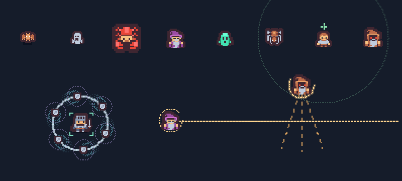

# 战斗表现、武器定位与敌人组合

## 采用的设计方法

- **先明确敌人的作用，再决定组合与外观。** 修复祭司制造优先击杀目标，扇射哨兵制造走位空隙；不是只换颜色和血量。参考 Harvey Smith 的 [Designing Enemies With Distinct Functions](https://www.gamedeveloper.com/design/designing-enemies-with-distinct-functions)。
- **预警必须说明攻击方向，并提供躲避窗口。** 狙击分跟踪、固定锁定、开火、休整；扇射先展示固定方向再发慢弹。参考 Mike Stout 的 [Enemy Attacks and Telegraphing](https://www.gamedeveloper.com/design/enemy-attacks-and-telegraphing)。
- **重复攻击声控制密度，重要信息优先。** 保留分组声部上限、优先级、动态压低战斗声；持续接触武器使用短且轻的声音，只在命中或挡弹时触发。参考 [Wwise 并发与优先级](https://www.audiokinetic.com/en/public-library/2024.1.8_8893/?id=optimizing_cpu&source=Help)，完整规则见 [声音设计](AUDIO_DESIGN.md)。

这些来源提供设计原则；下列数值是本项目的选择，不是行业统一标准。

## 武器分工

| 武器 | 主要用途 | 本轮决定 |
| --- | --- | --- |
| 脉冲刃 | 近敌追击、精准连续斩击 | 保留伤害；换挥切声，继续使用从角色到目标的动态轨迹 |
| 电弧核心 | 连锁清理密集小怪 | 保留连锁和雷击声；单靶伤害低不能直接当作弱武器依据 |
| 轨道卫星 | 保护近身空间、挡少量投射物 | 固定近轨道、扩展接触面、基础命中击退、共享挡弹冷却；新护盾轻撞声和尾迹 |
| 等离子炮 | 穿透与击退 | 保留当前能量弹、能量脉冲音效和参数 |
| 黑洞发生器 | 聚怪与区域持续消耗 | 保留牵引和超新星；不按单靶 DPS 与射线拉平 |
| 棱镜射线 | 直线持续输出、进化扇扫 | 保留 Lv1；Lv2–5 每 tick 从 19/24/29/34 改为 18/22/26/30；进化中央 50→36、两翼各 28→20；换短持续能量声 |

### 卫星为何重做覆盖

旧轨道从 Lv1 的 70 增至 Lv5 的 102，范围 Lv5 又推至 183.6。小怪穿过轨道后往往进入无法命中的内圈，导致纸面 DPS 正常，实战保护很差。

- 新轨道固定 **54**；基础数量 **3/3/4/4/5**，进化 **6**。
- 接触半径 **12/13.5/15/16.5/18**，进化 **20**，乘范围倍率；进化力场半宽 **14 × 范围倍率**。渲染与碰撞调用同一份几何参数。
- 原核心伤害 **14/18/22/26/30**、进化 **32** 与命中冷却保留；新增核心击退 **45**，仍应用敌人抗性。进化力场保持伤害 **22**、击退 **75**。
- 外来子弹触及防护圈可抵消一枚，基础共享冷却 **0.9/0.8/0.7/0.6/0.5 秒**，进化 **0.3 秒**；超频不缩短挡弹冷却。检测弹道线段以避免高速穿透漏判。
- 不抵消已经进入内圈的子弹、怪物接触伤害或地面危险区。保留内圈和远程火力需求，不提供全盘伤害或永久免伤。

### 调整前后实测

基线提交 `8de82da`。完整当前矩阵和每项条件见根目录 [CURRENT_BENCHMARK.json](../CURRENT_BENCHMARK.json)，可用 `node tests/verify.cjs --growth --no-ogg` 复测当前版本。

| 场景 | 旧版 | 本版 |
| --- | ---: | ---: |
| 卫星 Lv5，半径 13 小靶距离 40，10 秒 DPS | 0 | 108 |
| 卫星 Lv5，半径 46 大靶距离 100，10 秒 DPS | 108 | 108 |
| 卫星 Lv5，24 靶偏前方网格，10 秒总 DPS | 516 | 360 |
| 射线 Lv5，大靶距离 100，10 秒 DPS | 244.8 | 216 |
| 射线进化，同条件 | 611 | 438.8 |
| 卫星 Lv5，16 只小怪从 180 距离围攻，10 秒击杀数 | 0 | 16 |
| 上述围攻中，至少一只存活怪接触玩家的时间 | 8.28 秒 | 0.10 秒 |

围攻测试：静止玩家、无暴击、Lv5 单武器、16 只三倍基础血量的真实 SwarmDrone、60Hz，运行敌人移动和击退。它用于检查近身防御作用；接触时间不是实际扣血或人类胜率。进化卫星在该场景原本已经能杀 16 只且无接触，本轮维持这一结果。固定前方网格总伤害下降，体现了从外圈覆盖转向近身保护的取舍。

## 敌人组合与反制

| 新敌人 | 行为 | 玩家反制 | 场上上限 |
| --- | --- | --- | ---: |
| 修复祭司 | 绿色十字；每 3.8 秒治疗 130 范围内最多 3 只受伤普通怪，每只最多 18 血且不超过最大生命的 12%；施放前显示范围，施放后显示连线 | 优先接近击杀；不能治疗自己、其他祭司、精英或 Boss，也不能复活 | 2 |
| 扇射哨兵 | 橙色重装轮廓；固定三条路径预警 0.95 秒，再发 3 枚慢弹，休整 3.6 秒 | 看预警移动到弹道间隙；卫星可抵消其中一枚 | 2 |

祭司在休闲/标准/极境的 **120/95/75 秒**解锁，哨兵在 **200/170/140 秒**解锁。标准开局仍只有追踪和侦察敌人。新类型加入原有加权池，不额外增加总刷怪频率和总体容量。

狙击怪最多 **3** 只。狙击和哨兵共享同时预警预算：休闲 **1** 个，标准/极境 **2** 个，Boss 在场时最多允许 **1** 个新预警占位。已有预警正常结束，不在 Boss 入场瞬间突然跳过攻击流程。

## 持续瞄准线问题

复现旧版：20 秒内单只狙击有 6 秒瞄准、6 次射击，因此不能称为“完全没有冷却”。但锁定期间起点累计移动 136 世界单位，且屏外仍可开火；多只轮番锁定造成持续追踪感。

修复为：

1. 源头完整进入当前视口且距玩家不超过 360 才能开始瞄准；离开视口或射程取消。
2. 跟踪与锁定期间停止主动移动；锁定保存射击起点和角度。被击退超过 8 单位中断蓄力。
3. 最后锁定窗口至少 **0.3 秒**；休闲仍为 0.5 秒、标准 0.35 秒。
4. 开火后 **2.2 秒**休整，瞄准线消失。渲染只认明确的攻击状态。
5. 屏外敌人继续接近，避免手机窄视口中停在屏边永远不开火。

专项测试覆盖三难度 × 10/30/60/144Hz，锁定起点位移为 0；另外测试离屏取消、窄视口进入、预警占位、治疗边界、挡弹冷却、范围升级与近身围攻。360 局成长模拟仍沿用原有选卡权重和移动策略，没有为卫星调整机器人偏好。

自动测试不能判断所有设备的听感；当前也没有 iPhone 真机的音频或性能结论。
